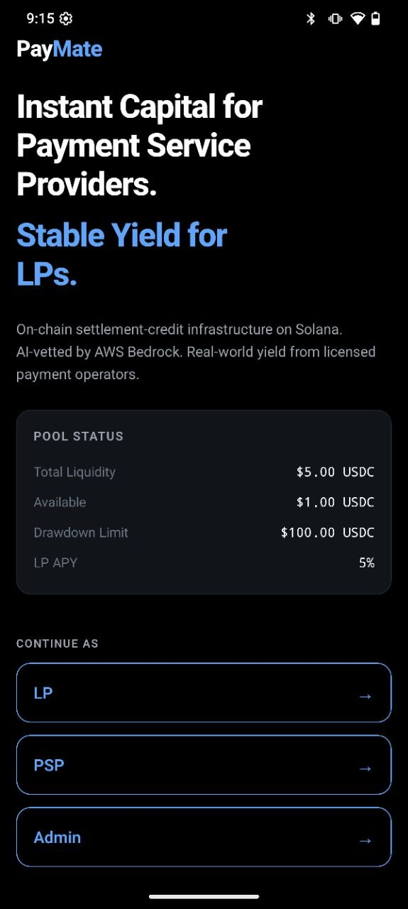
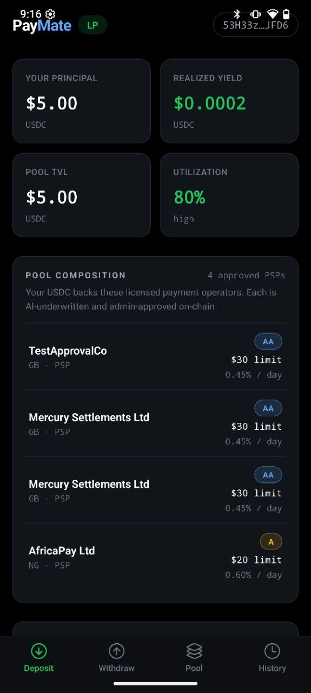
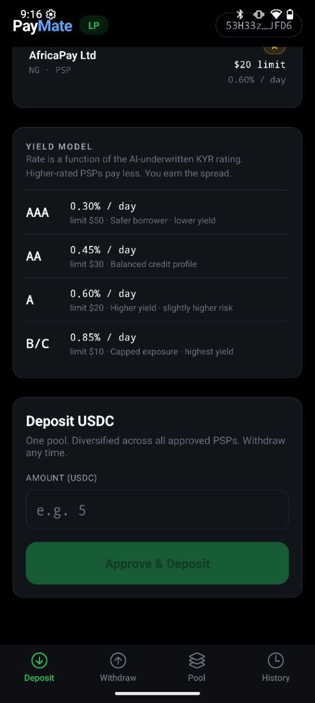
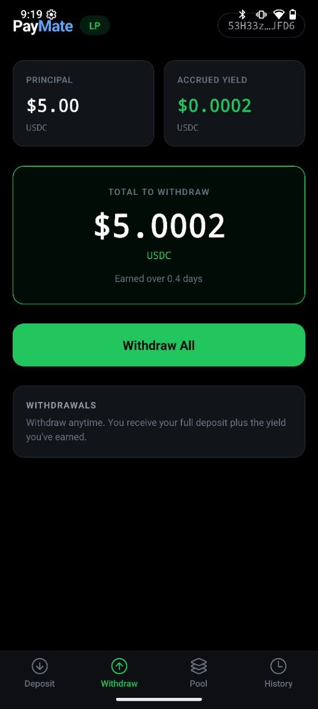
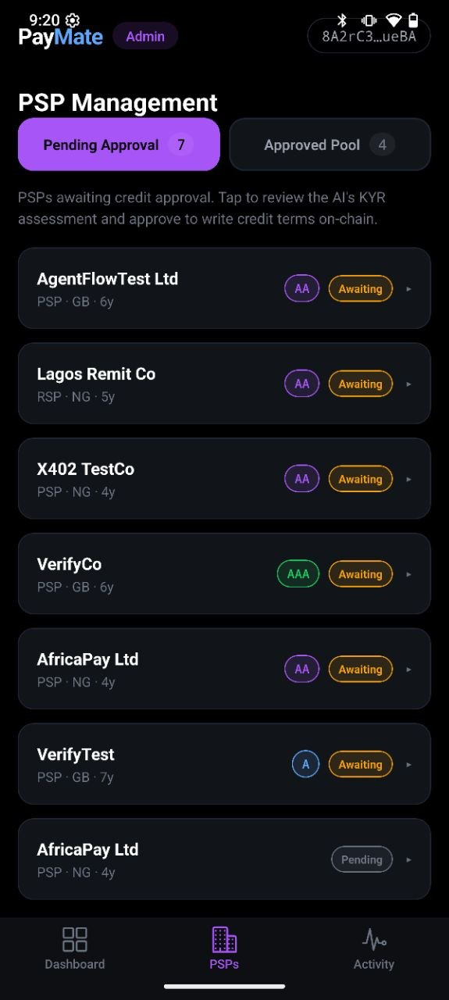

# PayMate

**On-chain credit infrastructure for stablecoin payment operators.**

A Solana Mobile dApp that gives licensed Payment Service Providers (PSPs) and remittance companies instant USDC credit, priced by AI underwriting agents that pay each other in USDC over Coinbase's x402 protocol. LPs deposit USDC into a shared pool and earn pro-rata yield from PSP fees.

Built at **EasyA Consensus Miami 2026**, targeting:
- **Solana Mobile Track**
- **Coinbase × AWS Agentic Track**

> Submission text: see [SUBMISSION.md](./SUBMISSION.md)
> Slide deck: in [docs/](./docs) (also at the linked Canva URL on the submission form)

---

## Demo

> **Audio walkthrough (~4 min, with audio):** https://www.loom.com/share/8e4104d875394056972317ab5e89f2dd
> **App demo on Solana Seeker (~2 min):** https://www.loom.com/share/3886019c187a4f369101f16e056b49e6

### Screenshots

Captured on a Solana Seeker running APK build #8.

**Splash · role select**


**LP · dashboard with Pool Composition**
The LP sees their principal, realized yield, pool TVL and utilization, plus a transparency card listing every approved PSP in the pool with their KYR rating and personal rate.


**LP · Yield Model + Deposit form**
The Yield Model card explains the dynamic rating-to-rate map (AAA pays 0.30 percent per day, AA 0.45 percent, A 0.60 percent, B/C 0.85 percent). LPs see exactly how their yield is priced.


**LP · Withdraw with realized yield**
Live computed total: principal plus accrued yield from PSP repayment fees, distributed pro-rata.


**PSP · approved with active drawdown**
The PSP has been admin-approved on-chain with a $30 credit limit at 0.45 percent per day. They've drawn $4 USDC; the live fee accrues by the second.


**PSP · Repay with live fee math (and friendly error handling)**
Repay screen pre-computes Total Due as principal plus the live-tracking fee, mirroring the on-chain math exactly. Errors are sanitized into clean user copy.


**Admin · PSP Management (Pending Approval / Approved Pool tabs)**
Two segmented tabs: Pending Approval (7) for KYBs awaiting credit approval, Approved Pool (4) for the active pool. Tap any row to expand the AI's KYR reasoning.


**Admin · Pool Operations dashboard**
Live read of on-chain pool state: total liquidity, available, fee reserve, utilization, plus the program's configured drawdown limit, default PSP rate, LP APY, and the program ID.


---

## What it does

PSPs settling stablecoin payments today face a structural problem: their customers expect instant settlement, but the on-chain rail clears T+1 to T+2. So PSPs front USDC out of pocket, or pay 5 to 8 percent for off-chain credit lines, or turn down volume.

PayMate is an on-chain credit pool that prefunds licensed PSPs against their incoming settlement flow. The whole loop runs on a single phone with three role lenses (LP, PSP, Admin), backed by:
- A Solana Anchor program that holds the pool and per-PSP credit terms as on-chain state
- AI agents on AWS Bedrock that underwrite KYB applications and pay each other in USDC over x402
- Real Circle USDC flowing through the vault on devnet (and Base Sepolia for the agent payments)

---

## Flow of funds

```
  LP wallet            POOL VAULT (Solana)            PSP wallet
     │                                                     │
     │  ① deposit() ──────────►   $10 USDC                 │
     │                                                     │
     │                       ② request_drawdown() ────────►│ $5 USDC
     │                                                     │
     │                                                     │  ③ off-chain
     │                                                     │     PSP settles
     │                                                     │     end-customer
     │                                                     │     (T+0 instant)
     │                                                     │
     │                                                     │     end-customer
     │                                                     │     pays PSP at T+1
     │                                                     │
     │  ④ repay()  ◄─────────  $5.05 USDC ────────────────│
     │                         (principal + 0.05 fee)      │
     │                                                     │
     │  ⑤ withdraw() ─────────► $10.05 USDC               │
     │     (principal + pro-rata share of fee_reserve)     │
```

Five state changes, four of them on-chain Solana transactions. The fifth (settlement to the end-customer) is off-chain because that's the underlying real-world payment the PSP is making. Every USDC transfer in steps 1, 2, 4, 5 is a public, signed transaction on Solana devnet.

The on-chain `request_drawdown` instruction reverts if the PSP's drawdown amount exceeds their on-chain credit limit. The `repay` instruction calculates `principal + (principal × rate × elapsed_seconds / day)` and sends the excess to the pool's `fee_reserve`. The `withdraw` instruction returns principal + pro-rata fee share. The pool primitive is the entire credit relationship.

---

## User journey

### LP (Liquidity Provider)
1. Open PayMate on Seeker → pick **LP** role → connect wallet (Solflare / Phantom)
2. See **Pool TVL, Utilization, Your Principal, Realized Yield**
3. See **POOL COMPOSITION** card listing every approved PSP with their KYR rating, credit limit, daily rate
4. See **YIELD MODEL** card showing the rating → rate map (AAA = 0.30%/day, AA = 0.45%, A = 0.60%, B/C = 0.85%)
5. Tap **Deposit USDC**, enter amount, sign in wallet → funds enter the pool vault
6. Anytime later, tap **Withdraw** → receive principal plus pro-rata share of the pool's accumulated fees

### PSP (Payment Service Provider)
1. Open PayMate → pick **PSP** role → connect wallet
2. First time: tap **Start KYB** → fill 16-field application across 4 steps (Company, Operations, Financial, Compliance)
3. Submit → AI scores in ~3 seconds (Bedrock Claude Haiku 4.5 + optional Compliance Sub-Agent over x402)
4. See your **KYR rating, score, AI reasoning** + sub-scores by section. Wait for admin approval.
5. Once approved on-chain: see **Drawdown Limit, KYR Rating, Daily Rate**, plus a **Draw Funds** form
6. Enter amount → sign → USDC arrives in your wallet instantly via Solana
7. Repay tab shows **principal + accrued fee** live (fee ticks up by the second). Tap **Repay Now** → pay back, position closes, fee goes to pool reserve

### Admin
1. Open PayMate → pick **Admin** → email/password login (`admin@paymate.com` / `paymate`)
2. **Pending Approval** tab: list of PSPs awaiting credit approval. Tap a row to expand the AI assessment, reasoning, KYB submission. Tap **Approve** → backend signs `set_credit_limit` on Solana with admin keypair.
3. **Approved Pool** tab: read-only operational view of every approved PSP, their on-chain credit terms, current activity. The on-chain Solana program enforces the credit cap automatically; admin doesn't gate every drawdown.

---

## How the blockchain interaction works

Three blockchains, three load-bearing roles:

### Solana (devnet)
The credit primitive itself.

- Anchor program: `5cuj7xG83GthayftBPcpppY6CsfMoPT9gmm1X62C3jCg`
- Six instructions: `init_pool`, `deposit`, `withdraw`, `set_credit_limit`, `request_drawdown`, `repay`
- PDAs: Pool, Vault, plus per-LP and per-PSP account PDAs (seeded by wallet address)
- USDC mint: Circle's official Solana devnet USDC `4zMMC9srt5Ri5X14GAgXhaHii3GnPAEERYPJgZJDncDU`
- Mobile signs via Solana Mobile Wallet Adapter on Seeker

### Base Sepolia (Coinbase x402)
Agent-to-agent USDC settlement.

- Three independently-funded agent wallets: orchestrator, Risk Agent, Compliance Sub-Agent
- Every KYB submission triggers `orchestrator → Risk Agent` payment over x402
- If the application is borderline, Risk Agent recursively calls Compliance Sub-Agent (also paid via x402)
- EIP-3009 `transferWithAuthorization`, signed with viem, settled via `https://x402.org/facilitator`
- Dynamic exact pricing: $0.012 for clean profiles, $0.045 when Compliance escalation is needed

### AWS Bedrock
The intelligence layer.

- Claude Haiku 4.5 underwrites every KYB application across 14 weighted criteria
- Returns a parseable KYR object (rating, total score, sub-scores by section, structured reasoning, economic decision)
- Sub-2-second p50 latency
- Reasoning shown in the UI is the model's literal output, not a template

---

## Architecture

```
       ┌──────────────────────┐
       │  Seeker / Mobile     │
       │  (Expo + MWA)        │
       └──────────┬───────────┘
                  │ HTTPS
                  ▼
   ┌────────────────────────────────────────┐
   │  AWS API Gateway HTTP API v2           │
   │  /kyb/submit · /kyb/status/{wallet}    │
   │  /pool/state · /lp/state · /psp/state  │
   │  /admin/psps · /admin/approve          │
   │  /agent/risk · /agent/compliance       │
   └──────────┬─────────────────────────────┘
              │
              ▼
  ┌────────────────────────────────────────────┐
  │ Lambda (Node 20)                           │
  │                                            │
  │   Orchestrator ── x402 USDC ──▶ Risk Agent │
  │                                       │    │
  │                                       │    │ x402
  │                                       ▼    │
  │                              Compliance Agent│
  │                                            │
  │   All three: Bedrock Claude Haiku 4.5     │
  └──┬──────────────────────────────────────┬─┘
     │                                       │
     │ DynamoDB                              │ Solana RPC (admin signs)
     ▼                                       ▼
  3 tables                          ┌──────────────────┐
  Users · KYBSubmissions ·          │ Anchor program   │
  AgentCallLog                      │ Pool · Vault ·   │
                                    │ LP · PSP PDAs    │
                                    └──────────────────┘
                                            ▲
                                            │ MWA-signed txs
                                  (mobile users for deposit /
                                   withdraw / drawdown / repay)
```

---

## Repo structure

```
PayMatePSP/
├── README.md            # This file.
├── SUBMISSION.md        # EasyA submission form text (summary, descriptions).
├── CANVA_SLIDES.md      # Slide deck source content (10 slides).
├── UI_BUGS.md           # Tracked UI issues for batch fixes.
├── program/             # Anchor program (Rust). Six instructions, ~600 LOC.
│   └── programs/program/src/lib.rs   <- on-chain logic
├── lambda/              # AWS Lambda + DynamoDB orchestrator (TypeScript).
│   ├── src/handlers/    <- /kyb/submit, /admin/approve, /lp/state, /psp/state
│   ├── src/lib/         <- DDB helpers, Solana account decoders, x402 client
│   └── infra/           <- deploy.sh, seed scripts, devnet verifier
├── agent/               # x402-paid AI agents (Risk + Compliance).
│   └── src/             <- Bedrock client, x402 server middleware
└── mobile/              # Expo React Native app (Seeker target).
    ├── app/             <- expo-router screens by role: (lp) (psp) (admin)
    └── src/             <- shared lib (api client, wallet, on-chain tx builders)
```

---

## Running it locally

### Prerequisites
- Bun >= 1.3
- Solana CLI (for devnet)
- Anchor CLI 0.32 (only if rebuilding the program)
- AWS CLI configured with credentials (only if redeploying the Lambda)
- An Expo account (free) to build the mobile APK

### Mobile (web preview, no APK)

```bash
cd mobile
bun install
bun run web
# Opens http://localhost:8081
```

### Lambda (deploy your own)

```bash
cd lambda
bun install
bash infra/deploy.sh   # Provisions DynamoDB tables, Lambda, API Gateway HTTP API
```

### Verify the on-chain credit pool

```bash
cd lambda
bun run infra/verify-devnet-full-flow.ts
# Walks through deposit → set_credit_limit → drawdown → repay → withdraw,
# prints a Solscan tx link for each step.
```

---

## On-chain proofs

- **Anchor program** (devnet): [`5cuj7xG83GthayftBPcpppY6CsfMoPT9gmm1X62C3jCg`](https://solscan.io/account/5cuj7xG83GthayftBPcpppY6CsfMoPT9gmm1X62C3jCg?cluster=devnet)
- Latest pro-rata yield upgrade: `HTRAdDE7TKRCTvvUxjJv5ss9Sykdboop5qdiqNqV3SVMDpDFrwmdN2hNnLnn19ZKFLga3HD69Jq7mciDqoJADr6`
- Sample approval (Mercury Settlements PSP, $30 limit): `2fjUy41MG2ujZCzzZc9xRaksEVqQuBg78z1kwCfp2pDFGRF3gycWNn1J5Yy7mvS4PC9PtXYZZq3dT2JR4PHw7v6d`

Every KYB submission produces 1 to 2 USDC transfers between agent wallets on Base Sepolia (orchestrator → Risk Agent, optionally Risk Agent → Compliance Sub-Agent). All transfers are logged in DynamoDB `PayMate_AgentCallLog` with the txHash.

---

## Tracks targeted

### Solana Mobile Track
- Native Expo app, Mobile Wallet Adapter for Seeker
- Anchor program holding the entire credit relationship as on-chain state
- Sub-cent transaction fees make a credit pool with frequent drawdown / repayment cycles viable
- Devnet verified end-to-end across all six instructions

### Coinbase × AWS Agentic Track
- Real Bedrock Claude Haiku 4.5 underwriting (not a wrapper or stub)
- Multi-agent topology: orchestrator → Risk Agent → Compliance Sub-Agent
- All inter-agent calls settle in real USDC over x402 via Coinbase's facilitator
- Production-shaped: Lambda + on-demand DynamoDB + IAM least-privilege
